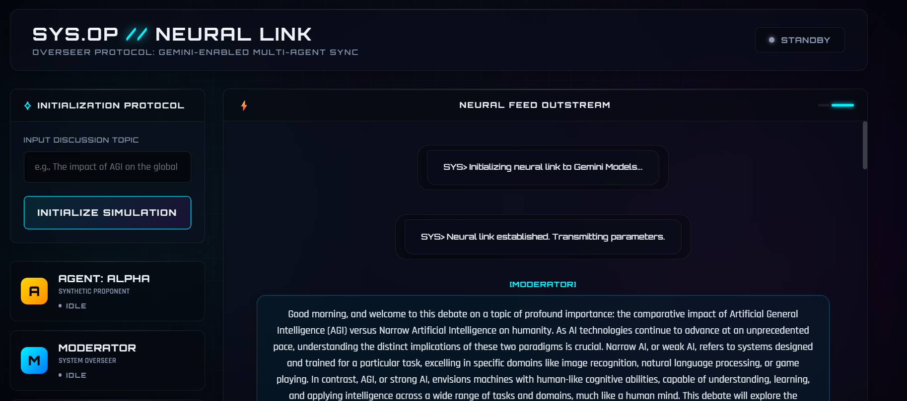
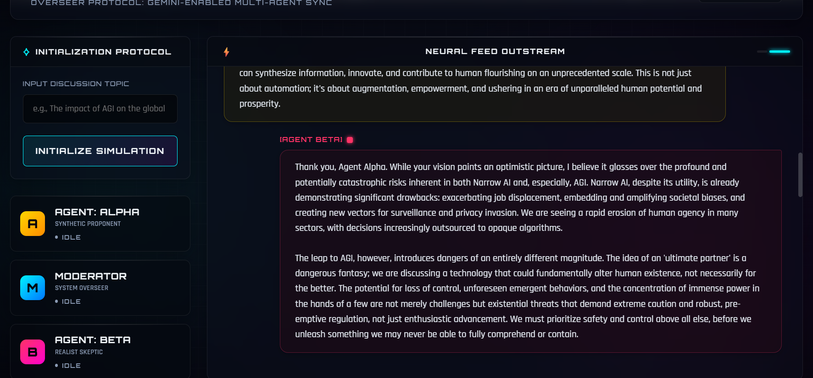

# Sci-Fi Multi-Agent Simulation Dashboard

A real-time, highly sci-fi themed web dashboard that orchestrates formal debates between autonomous AI agents. The frontend connects securely via WebSockets to a FastAPI backend, executing multiple sequential prompts against standard and premium Google Gemini models with intelligent fallback mechanisms.

<div align="center">
  
  <br>
  <em>System Control Panel and Agent Overview</em>
</div>

<div align="center">
  
  <br>
  <em>Live Neural Feed During Synthesis</em>
</div>


## Features

- **Multi-Agent Debates**: Automatically manages a Moderator, a Proponent (Agent Alpha), and a Skeptic (Agent Beta) through conversational rounds.
- **Sci-Fi Hologram HUD**: Modern CSS grid with deep dark space coloring (`#0a0f1a`), highly styled glassmorphism, glowing magenta/cyan borders, and typewriter chat effects.
- **Real-time WebSockets**: Prevents browser timeouts by streaming events independently over full-duplex WebSockets instead of blocking HTTP requests.
- **Resilient AI Fallback Mechanism**: Rather than permanently hanging when an API is busy, the backend gracefully catches timeouts over 10 seconds and cascades the request down a list of free fallback models (e.g., `gemini-2.5-flash`, `gemini-2.0-flash`, `llama3-8b-8192`, `llama-3.3-70b-versatile`).

## Technology Stack

- **Backend**: FastAPI, WebSockets (`uvicorn`)
- **AI Integration**: `google-genai` and `groq` Python SDKs
- **Frontend**: Vanilla HTML5, CSS3 Variables, JavaScript (ES6)
- **Typography**: Google Fonts (Orbitron and Rajdhani)

## Setup and Installation

1. **Clone the repository:**
   Ensure you are in the project root directory.

2. **Install the dependencies:**
   ```bash
   pip install -r requirements.txt
   ```

3. **Configure Environment Variables:**
   Copy the example environment file:
   ```bash
   cp .env.example .env
   ```
   Add your `GEMINI_API_KEY` and optionally `GROQ_API_KEY` (for Groq fallbacks) to `.env`.

## Running the Dashboard

1. **Start the Uvicorn Server:**
   ```bash
   uvicorn app:app --reload
   ```

2. **Access the Application:**
   Open your browser and navigate to exactly:
   [http://127.0.0.1:8000](http://127.0.0.1:8000)

3. **Initialize the Link:**
   Provide a topic on the control panel, press initialize, and watch the agents compute their responses.

## Code Structure

- `app.py`: FastAPI server configuration, WebSocket router, and static directory mounting.
- `simulation.py`: Core `Agent` class definitions equipped with asynchronous generation logic and automated API fallback arrays.
- `static/`: Contains the Sci-Fi dashboard's layout (`index.html`), aesthetics (`style.css`), and the WebSocket client controller (`script.js`).
